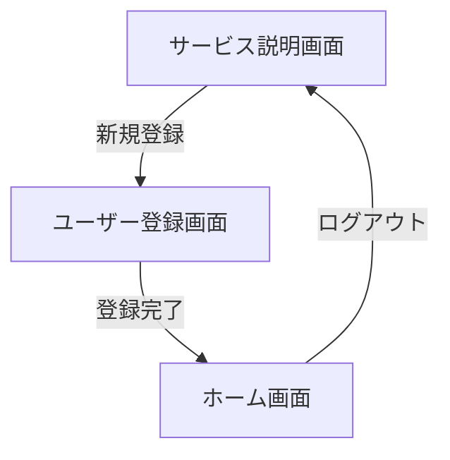
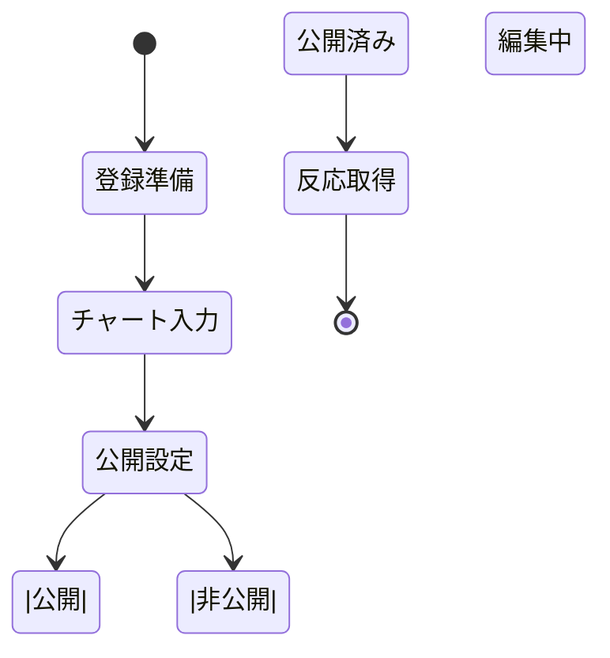

description: system description template
---

# システム概要テンプレート

<!-- プロダクトの目的や価値訴求、想定するユーザー像を簡潔にまとめる -->

## 1. プロダクト概要
- 本節ではプロダクトの存在意義と利用シーンを一目で理解できるよう、3つの観点（目的・ターゲット・価値）を端的に記述します。
- 可能であれば、企業内で期待されるアウトカムや既存施策との差別化ポイントも追記します。
- **目的**: 社員同士の相互理解を促すライフライン共有プラットフォームを提供する
- **ターゲットユーザー**: 新入社員・既存社員・人事担当者
- **主要価値**: ライフイベントを可視化し、コメントやリアクションを通じたコミュニケーションを活性化する

<!-- 現状の課題とシステムでどう解決するかを整理する。必要に応じて行を追加 -->
## 2. 背景・課題
- ここではプロダクトが解決すべき課題を列挙し、なぜ着手が必要なのかを関係者に伝えます。
- 課題IDは業務側の課題管理票と紐づけると再利用しやすくなります。
| 課題ID | 課題 | 詳細 | 解決方針 |
| --- | --- | --- | --- |
| P-01 | 新メンバーの早期溶け込み | バックグラウンド共有機会が限られ、関係構築に時間がかかる | ライフラインチャートを用いた自己紹介とコメント機能を提供する |
| P-02 | 一方向の情報発信 | 既存の自己紹介資料は閲覧のみで相互コミュニケーションが生まれない | リアクション／コメント機能で双方向のやり取りを支援 |
| P-03 | 組織横断の共通話題不足 | 部門が違うと接点が少なく、雑談が生まれにくい | 共感ポイントをタグで分類し検索できる仕組みを導入 |

<!-- プロダクト全体の機能を一覧化。優先度や関連リソースを補足 -->
## 3. 機能一覧
- 以下の表でシステムが提供する主要機能を俯瞰します。機能IDは要件定義書やJiraチケット番号と揃えると管理しやすいです。
- 備考欄には優先度、リリース時期、依存関係など任意の情報を追加してください。
| 機能ID | 機能名 | 概要 | 関連画面 / モジュール | 備考 |
| --- | --- | --- | --- | --- |
| FN-01 | ライフライン作成 | 折れ線グラフ形式で人生イベントを入力・保存する | チャート編集画面 / ChartEditorModule | 下書き保存対応 |
| FN-02 | 公開チャート閲覧 | 公開設定されたチャートを一覧／詳細で閲覧 | チャート一覧画面 / ChartListModule | フィルタ・検索対応 |
| FN-03 | コメント・リアクション | チャートに対しコメント送信や「いいね」リアクションを記録 | チャート詳細画面 / InteractionModule | 絞り込み表示対応 |
| FN-04 | チーム内共有リンク発行 | 特定チーム向けの共有URLを生成 | 管理コンソール / ShareModule | 有効期限設定可 |

<!-- 代表的な画面と役割、対応する機能IDを整理する -->
## 4. 画面一覧
- 各画面の役割を理解できるよう、業務フローの中での位置付けや主要コンポーネントを補足します。
- 対応機能列は複数指定が可能です。特定機能に依存しない汎用画面の場合は "Common" などで明示します。
| 画面名 | 説明 | 対応機能 |
| --- | --- | --- |
| サービス説明画面 | システム概要・利用方法を案内し同意取得を行う | FN-02 |
| チャート編集画面 | ライフラインのイベント入力、公開設定変更を行う | FN-01 |
| チャート詳細画面 | 選択したチャートの内容とコメント／リアクションを表示 | FN-02, FN-03 |
| 管理コンソール | チーム設定やアクセス権限を管理する | FN-04 |

<!-- ユーザーフローをMermaidで図示。主要な遷移と例外パターンを明記 -->
## 5. 画面遷移
- Mermaid の `flowchart` 記法を用い、主要な画面遷移とアクセスポイントを明記します。
- 例外遷移（タイムアウトや認証エラーなど）は `%%` コメントを外して矢印を追加してください。


<!-- 主なアクターと振る舞いをMermaidで可視化。状態や分岐を明確にする -->
## 6. アクティビティ図
- 利用者の行動とシステム処理の分岐を表現します。必要に応じて swimlane を導入し、アクター毎の責務を分かりやすくします。
- 状態遷移の終端には `[ * ]` を配置し、フローの完了条件を示します。


<!-- データモデルや主要オブジェクトの定義と関係性を整理 -->
## 7. 概念一覧
- ER 図やドメインモデルで利用する用語の定義を共有します。概念数が多い場合はカテゴリ毎に表を分割することを検討してください。
- 関連概念には一次・二次関係を併記するとスキーマ設計時の参照がスムーズになります。
| 概念 | 説明 | 関連概念 |
| --- | --- | --- |
| User | システムにログインする社員。プロフィール情報を保持する | Chart, Comment |
| Chart | 人生イベントを時間軸で管理するライフラインチャート | User, Event, Reaction |
| Comment | チャートに対するユーザー投稿 | User, Chart |
| Reaction | 「いいね」などのリアクション履歴 | User, Chart |
| Team | 社員をまとめる単位。チーム毎にアクセス権を設定 | User, Chart |

<!-- リポジトリ全体のディレクトリ構造を簡易ツリーで共有 -->
## 8. リポジトリ構造
- 実際のディレクトリ構成を `tree` コマンド等で取得し、不要なビルド成果物を除いて掲載します。
- モノレポの場合はアプリケーション単位でブロックを分けると読みやすくなります。
```text
.
├─ src/
│  ├─ components/
│  ├─ pages/
│  ├─ services/
│  └─ styles/
├─ prisma/
├─ tests/
└─ docs/
```

<!-- 使用技術やバージョン、主要ライブラリを整理 -->
## 9. テックスタック
- レイヤー毎に採用技術を記載し、サポートポリシー（LTS/最新など）や主要ライブラリも整理します。
- 監視やCI/CDなど運用面のツールもあわせて記載するとオンボーディングが円滑になります。
| レイヤー | 技術 / ツール | バージョン | メモ |
| --- | --- | --- | --- |
| フロントエンド | Next.js | 14.x | App Router, TypeScript対応 |
| バックエンド | NestJS | 10.x | REST + GraphQL構成 |
| データベース | PostgreSQL | 15.x | Prisma ORM経由でアクセス |
| インフラ | Vercel / AWS Lambda | - | 環境に応じて選択 |
| コラボレーション | Storybook, Figma | 最新 | UI設計・共有用途 |

<!-- 特記事項や未決事項、関連資料リンクなどをメモ -->
## 10. 補足・メモ
- 重要な意思決定や未確定事項、参照URLを箇条書きで管理します。
- 定期レビューのたびに更新日を記載すると情報鮮度を把握しやすくなります。
- KPI例: 初回投稿完了率 80%以上
- リリースマイルストーン: α版 2026 Q1 / β版 2026 Q2
- 参考資料: /docs/system-overview.pdf
---
